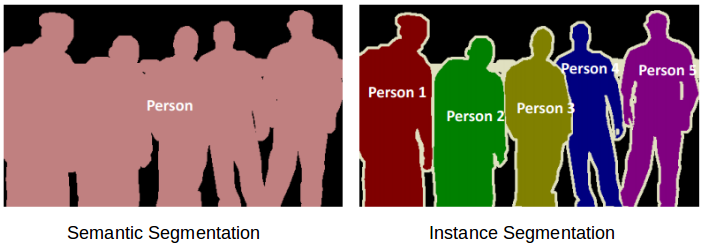
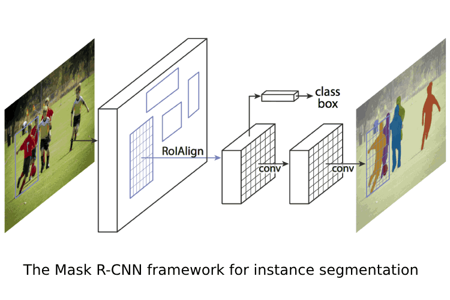
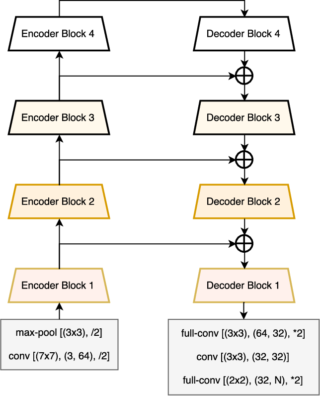
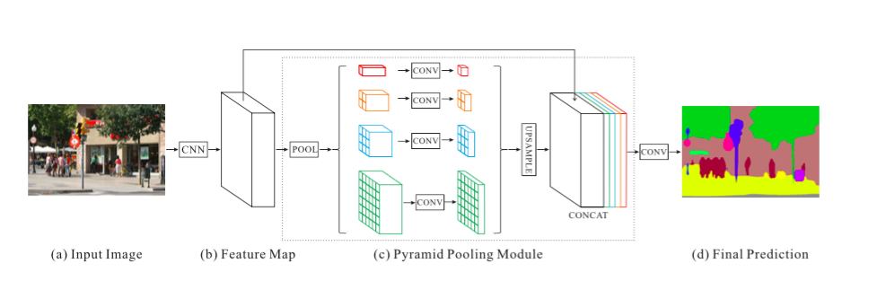

Table of contents
=================
<a name="table-of-contents">

* [Overview](#overview)
* [Models](#models)
    * [Mask R-CNN](#mask-r-cnn)
    * [U-Net](#u-net)
    * [Feature Pyramid Network](#feature-pyramid-network)
    * [LinkNet](#linknet)
    * [Pyramid Scene Parsing Network](#pyramid-scene-parsing-network)
* [Conclusion](#conclusion)

Overview
========
<a name="overview">

These days, image segmentation is one of the main problems in the field of computer vision. 
It is one of the best approaches toward scene understanding. 
With the rise of the popularity of deep learning in recent years, 
many of tasks regarding image segmentation are being tackled by deep neural networks, 
with Convolutional Neural Networks in the lead.

There are two approaches for image segmentation task, namely **semantic segmentation** and **instance segmentation**, 
example shown below:

    
  <a href="https://www.analyticsvidhya.com/blog/2019/04/introduction-image-segmentation-techniques-python">Source</a>

In **semantic segmentation**, every pixel in the image belongs to a particular class, 
in case of our example, there are two classes: person and background. 
Moreover, all the pixels corresponding to a given class are represented by the same color.

In instance segmentation, as in the previous type, every pixel in the image belongs to a particular class. 
However, different objects of the same class have different colors, unlike in semantic segmentation.

There are many different architectures e.g.:

1. Mask Region-based Convolutional Neural Network (Mask R-CNN)
2. U-Net
3. Feature Pyramid Network (FPN)
4. LinkNet
5. Pyramid Scene Parsing Network

Models
======
<a name="models">

Mask R-CNN
----------
<a name="mask-r-cnn">

This architecture was presented in a paper titled Mask R-CNN on March 20th, 2017. 
It is an extended version of Faster R-CNN with an added branch for predicting an object mask 
in parallel with the existing branch for bounding box recognition from Faster R-CNN.

    
  <a href="https://arxiv.org/pdf/1703.06870.pdf">Source</a>

U-Net
-----
<a name="u-net">

This architecture was presented in a paper titled U-Net: Convolutional Networks for Biomedical Image Segmentation on 
May 18th, 2015. It consists of a contracting path to capture context and a symmetric expanding path that enables precise
localization.

    
  <a href="https://arxiv.org/pdf/1505.04597.pdf">Source</a>

Feature Pyramid Network
-----------------------
<a name="feature-pyramid-network">

This architecture was presented in a paper titled Feature Pyramid Networks for Object Detection on December 9th, 2016. 
It is a top-down architecture with lateral connections developed for building high-level semantic feature maps at all 
scales.

    
  <a href="http://presentations.cocodataset.org/COCO17-Stuff-FAIR.pdf">Source</a>

LinkNet
-------
<a name="linknet">

This architecture was presented in a paper titled LinkNet: Exploiting Encoder Representations for Efficient Semantic 
Segmentation on June 14th, 2017. Authors goal was to get accurate instance level predictions without compromising 
processing time of the network.

    
  <a href="https://arxiv.org/pdf/1707.03718.pdf">Source</a>

Pyramid Scene Parsing Network
-----------------------------
<a name="pyramid-scene-parsing-network">

This architecture was presented in a paper titled Pyramid Scheme Parsing Network on December 4th, 2016. In the article, 
authors exploited the capability of global context information by different-region-based context aggregation through 
pyramid pooling module together with the proposed pyramid scheme parsing network.

  <a href="https://arxiv.org/pdf/1612.01105.pdf">Source</a>

Conclusion
==========
<a name="conclusion">

Architectures briefly presented in the above section are only a few of many. For our purpose, I suggest we try to 
implement and test those starting with U-Net. Our implementation will focus on the semantic segmentation, instance
segmentation might be tested in later phases of the project.